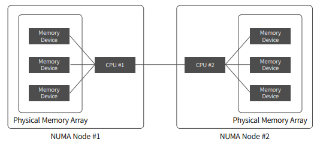

# Linux system information

> OS : CentOS

### Kernel data check
```bash
# CMD
uname -a

* 커널 정보 데이터를 확인 하고자 할 경우에 사용한다

# Result
Linux localhost.localdomain 6.12.0-43.el10.x86_64 #1 SMP PREEMPT_DYNAMIC Mon Jan 20 12:57:45 UTC 2025 x86_64 GNU/Linux

> Kernel Version : 5.15.167.4-microsoft-standard-WSL2
> Bit : 64
```

### Kernel bootloader log msg
```bash
# CMD
dmesg

> Kernel이 Memory를 인식하는 과정과 H/W를 인식하고 Driver를 올리는 과정, 부팅 시 적용된 커널 파라미터 등 확인이 가능하다

# Result
[    0.000000] Linux version 5.15.167.4-microsoft-standard-WSL2 (root@f9c826d3017f) (gcc (GCC) 11.2.0, GNU ld (GNU Binutils) 2.37) #1 SMP Tue Nov 5 00:21:55 UTC 2024
[    0.000000] Command line: initrd=\initrd.img WSL_ROOT_INIT=1 panic=-1 nr_cpus=16 hv_utils.timesync_implicit=1 console=hvc0 debug pty.legacy_count=0 WSL_ENABLE_CRASH_DUMP=1
{...}
[    0.000000] BIOS-provided physical RAM map:
[    0.000000] BIOS-e820: [mem 0x0000000000000000-0x000000000009ffff] usable
[    0.000000] BIOS-e820: [mem 0x00000000000e0000-0x00000000000e0fff] reserved
[    0.000000] BIOS-e820: [mem 0x0000000000100000-0x00000000001fffff] ACPI data
[    0.000000] BIOS-e820: [mem 0x0000000000200000-0x00000000f7ffffff] usable
[    0.000000] BIOS-e820: [mem 0x0000000100000000-0x00000003efdfffff] usable
[    0.000000] NX (Execute Disable) protection: active
[    0.000000] DMI not present or invalid.
[    0.000000] Hypervisor detected: Microsoft Hyper-V
[    0.000000] Hyper-V: privilege flags low 0xae7f, high 0x3b8030, hints 0x900c2c, misc 0xe0bed7b6
[    0.000000] Hyper-V Host Build:26100-10.0-2-0.2894
[    0.000000] Hyper-V: Nested features: 0x4a0000
[    0.000000] Hyper-V: LAPIC Timer Frequency: 0x1e8480
[    0.000000] Hyper-V: Using hypercall for remote TLB flush
[    0.000000] clocksource: hyperv_clocksource_tsc_page: mask: 0xffffffffffffffff max_cycles: 0x24e6a1710, max_idle_ns: 440795202120 ns
[    0.000002] tsc: Detected 3194.001 MHz processor
[    1.529879] sd 0:0:0:2: [sdc] Attached SCSI disk
[    1.644883] hv_storvsc fd1d2cbd-ce7c-535c-966b-eb5f811c95f0: tag#255 cmd 0x2a status: scsi 0x0 srb 0x4 hv 0xc00000a1
[    1.663369] hv_storvsc fd1d2cbd-ce7c-535c-966b-eb5f811c95f0: tag#383 cmd 0x2a status: scsi 0x0 srb 0x4 hv 0xc00000a1
[    1.679604] hv_storvsc fd1d2cbd-ce7c-535c-966b-eb5f811c95f0: tag#511 cmd 0x2a status: scsi 0x0 srb 0x4 hv 0xc00000a1
{...}
[   26.530525] systemd-journald[49]: Collecting audit messages is disabled.
[   26.570045] systemd-journald[49]: Received client request to flush runtime journal.
[   26.570134] systemd-journald[49]: File /var/log/journal/7926df65b5a64043b4c74739ac8c4276/system.journal corrupted or uncleanly shut down, renaming and replacing.
[   27.377066] WSL (2): Creating login session for pitlane
[   33.758374] systemd-journald[49]: Time jumped backwards, rotating.
[   43.361357] systemd-journald[49]: Time jumped backwards, rotating.
[   49.186522] hv_balloon: Max. dynamic memory size: 15998 MB
[   52.532274] systemd-journald[49]: Time jumped backwards, rotating.
[  144.385459] systemd-journald[49]: Time jumped backwards, rotating.
```

```bash
# CMD
dmesg | grep -i kernel | more

> grep과 more를 사용해서 Kernel의 필요한 데이터를 불러 온다

# Result
[    0.000000] KERNEL supported cpus:
[    0.000000] platform_pci_unplug: Netfront and the Xen platform PCI driver have been compiled for this kernel: unplug emulated NICs.
[    0.000000] platform_pci_unplug: Blkfront and the Xen platform PCI driver have been compiled for this kernel: unplug emulated disks.
               in your root= kernel command line option
[    0.015650] Booting paravirtualized kernel on Xen HVM
[    0.017249] Kernel command line: BOOT_IMAGE=/vmlinuz-6.8.0-1021-aws root=PARTUUID=2bb9818b-3393-4017-8da7-c739e7b96eac ro console=tty1 console=ttyS0 nvme_coreio_timeout=4294967295 panic=-1
[    0.017303] Unknown kernel command line parameters "BOOT_IMAGE=/vmlinuz-6.8.0-1021-aws", will be passed to user space.
[    0.019578] Memory: 964788K/1048180K available (22528K kernel code, 4446K rwdata, 13976K rodata, 5088K init, 4616K bss, 83132K reserved, 0K cma-reserved)
[    0.021069] Kernel/User page tables isolation: enabled
[    0.399024] DMA: preallocated 128 KiB GFP_KERNEL pool for atomic allocations
[    0.400027] DMA: preallocated 128 KiB GFP_KERNEL|GFP_DMA pool for atomic allocations
[    0.401153] DMA: preallocated 128 KiB GFP_KERNEL|GFP_DMA32 pool for atomic allocations
[    0.886808] Loaded X.509 cert 'Build time autogenerated kernel key: a4c3ef85b2401ac78c31d0113e76c9ea2f5229d2'
[    0.893350] Loaded X.509 cert 'Canonical Ltd. Kernel Module Signing: 88f752e560a1e0737e31163a466ad7b70a850c19'
[    0.935846] Loaded X.509 cert 'Build time autogenerated kernel key: a4c3ef85b2401ac78c31d0113e76c9ea2f5229d2'
[    1.359286] Freeing unused kernel image (initmem) memory: 5088K
[    1.360627] Write protecting the kernel read-only data: 36864k
[    1.366208] Freeing unused kernel image (rodata/data gap) memory: 360K
[    2.328361] systemd[1]: Listening on systemd-udevd-kernel.socket - udev Kernel Socket.
[    2.351585] systemd[1]: Mounting sys-kernel-debug.mount - Kernel Debug File System...
[    2.361569] systemd[1]: Mounting sys-kernel-tracing.mount - Kernel Trace File System...
[    2.422487] systemd[1]: Starting modprobe@configfs.service - Load Kernel Module configfs...
[    2.436937] systemd[1]: Starting modprobe@dm_mod.service - Load Kernel Module dm_mod...
[    2.460673] systemd[1]: Starting modprobe@drm.service - Load Kernel Module drm...
[    2.472716] systemd[1]: Starting modprobe@efi_pstore.service - Load Kernel Module efi_pstore...
[    2.487585] systemd[1]: Starting modprobe@fuse.service - Load Kernel Module fuse...
[    2.508856] systemd[1]: Starting modprobe@loop.service - Load Kernel Module loop...
[    2.539166] systemd[1]: Starting systemd-modules-load.service - Load Kernel Modules...

# Need data check
> Kernel command line [0.024643]
> Memory [0.069680]
```

### Crash kernel
```bash
# CMD
cat /proc/cmdline

# Result
BOOT_IMAGE=/vmlinuz-6.8.0-1021-aws root=PARTUUID=2bb9818b-3393-4017-8da7-c739e7b96eac ro console=tty1 console=ttyS0 nvme_core.io_timeout=4294967295 panic=-1

> Kernel command line [0.024643]의 이미지를 로딩 했다는 의미이다
```

* ## Kernel compile data check
  ```bash
  # CMD
  cat /boot/config-`uname -r` | more

  # Result
  CONFIG_CC_VERSION_TEXT="x86_64-linux-gnu-gcc-13 (Ubuntu 13.3.0-6ubuntu2~24.04) 13.3.0"
  CONFIG_CC_IS_GCC=y
  CONFIG_GCC_VERSION=130300
  CONFIG_CLANG_VERSION=0
  CONFIG_AS_IS_GNU=y
  CONFIG_AS_VERSION=24200
  CONFIG_LD_IS_BFD=y
  CONFIG_LD_VERSION=24200
  CONFIG_LLD_VERSION=0
  CONFIG_RUST_IS_AVAILABLE=y
  CONFIG_CC_CAN_LINK=y
  CONFIG_CC_CAN_LINK_STATIC=y
  CONFIG_CC_HAS_ASM_GOTO_OUTPUT=y
  CONFIG_CC_HAS_ASM_GOTO_TIED_OUTPUT=y
  CONFIG_TOOLS_SUPPORT_RELR=y
  CONFIG_CC_HAS_ASM_INLINE=y
  CONFIG_CC_HAS_NO_PROFILE_FN_ATTR=y
  CONFIG_PAHOLE_VERSION=125
  CONFIG_IRQ_WORK=y
  CONFIG_BUILDTIME_TABLE_SORT=y
  CONFIG_THREAD_INFO_IN_TASK=
  ```

# System H/W information data
* ## BIOS
  ```bash
  # CMD
  dmidecode -t bios


  # Result
  # dmidecode 3.6
  Getting SMBIOS data from sysfs.
  SMBIOS 2.7 present.

  Handle 0x0000, DMI type 0, 24 bytes
  BIOS Information
        Vendor: Phoenix Technologies LTD
        Version: 6.00
        Release Date: 11/12/2020
        Address: 0xEA480
        Runtime Size: 88960 bytes
        ROM Size: 64 kB
        Characteristics:
                ISA is supported
                PCI is supported
                PC Card (PCMCIA) is supported
                PNP is supported
                APM is supported
                BIOS is upgradeable
                BIOS shadowing is allowed
                ESCD support is available
                Boot from CD is supported
                Selectable boot is supported
                EDD is supported
                Print screen service is supported (int 5h)
                8042 keyboard services are supported (int 9h)
                Serial services are supported (int 14h)
                Printer services are supported (int 17h)
                CGA/mono video services are supported (int 10h)
                ACPI is supported
                Smart battery is supported
                BIOS boot specification is supported
                Function key-initiated network boot is supported
                Targeted content distribution is supported
        BIOS Revision: 4.6
        Firmware Revision: 0.0
  ```

* ## System
  ```bash
  # CMD
  dmidecode -t system

  # Result
  # dmidecode 3.5
  Getting SMBIOS data from sysfs.
  SMBIOS 2.7 present.

  Handle 0x0100, DMI type 1, 27 bytes
  System Information
          Manufacturer: Xen
          Product Name: HVM domU
          Version: 4.11.amazon
          Serial Number: ec2a0190-8ea5-dd94-683c-5961b917fa24
          UUID: ec2a0190-8ea5-dd94-683c-5961b917fa24
          Wake-up Type: Power Switch
          SKU Number: Not Specified
          Family: Not Specified

  Handle 0x2000, DMI type 32, 11 bytes
  System Boot Information
          Status: No errors detected
  ```

* ## Process
  ```bash
  # CMD
  dmidecode -t processor
  
  # Result
  # dmidecode 3.5
  Getting SMBIOS data from sysfs.
  SMBIOS 2.7 present.

  Handle 0x0401, DMI type 4, 35 bytes
  Processor Information
          Socket Designation: CPU 1
          Type: Central Processor
          Family: Other
          Manufacturer: Intel
          ID: F1 06 04 00 FF FB 8B 17
          Version: Not Specified
          Voltage: Unknown
          External Clock: Unknown
          Max Speed: 2300 MHz
          Current Speed: 2300 MHz
          Status: Populated, Enabled
          Upgrade: Other
          L1 Cache Handle: Not Provided
          L2 Cache Handle: Not Provided
          L3 Cache Handle: Not Provided
          Serial Number: Not Specified
          Asset Tag: Not Specified
          Part Number: Not Specified

  # Need to data check
  > Socket Designation
  > Manufacturer
  ```

* ## Cpu info
  ```bash
  # CMD
  cat /proc/cpuinfo

  # Result
  processor       : 0
  vendor_id       : GenuineIntel
  cpu family      : 6
  model           : 79
  model name      : Intel(R) Xeon(R) CPU E5-2686 v4 @ 2.30GHz
  stepping        : 1
  microcode       : 0xd0003f6
  cpu MHz         : 2299.998
  cache size      : 46080 KB
  physical id     : 0
  siblings        : 1
  core id         : 0
  cpu cores       : 1
  apicid          : 0
  initial apicid  : 0
  fpu             : yes
  fpu_exception   : yes
  cpuid level     : 13
  wp              : yes
  flags           : fpu vme de pse tsc msr pae mce cx8 apic sep mtrr pge mca cmov pat pse36 clflush mmx fxsr sse sse2 ht syscall nx rdtscp lm constant_tsc rep_good nopl xtopology cpuid tsc_known_freq pni pclmulqdq ssse3 fma cx16 pcid sse4_1 sse4_2 x2apic movbe popcnt tsc_deadline_timer aes xsave avx f16c rdrand hypervisor lahf_lm abm pti fsgsbase bmi1 avx2 smep bmi2 erms invpcid xsaveopt
  bugs            : cpu_meltdown spectre_v1 spectre_v2 spec_store_bypass l1tf mds swapgs itlb_multihit mmio_stale_data bhi
  bogomips        : 4599.99
  clflush size    : 64
  cache_alignment : 64
  address sizes   : 46 bits physical, 48 bits virtual
  power management:
  ```

  ```bash
  # CMD
  lscpu

  # Result
  Architecture:             x86_64
  CPU op-mode(s):         32-bit, 64-bit
  Address sizes:          46 bits physical, 48 bits virtual
  Byte Order:             Little Endian
  CPU(s):                 1
  On-line CPU(s) list:    0
  Vendor ID:              GenuineIntel
  BIOS Vendor ID:         Intel
  Model name:             Intel(R) Xeon(R) CPU E5-2686 v4 @ 2.30GHz
    BIOS Model name:      CPU @ 2.3GHz
    BIOS CPU family:      1
    CPU family:           6
    Model:                79
    Thread(s) per core:   1
    Core(s) per socket:   1
    Socket(s):            1
    Stepping:             1
    BogoMIPS:             4599.99
    Flags:                fpu vme de pse tsc msr pae mce cx8 apic sep mtrr pge mca cmov pat pse36 clflush mmx fxsr sse sse2 ht syscall nx rdtscp lm constant_tsc rep_good nopl xtopology cpuid tsc_known_freq pni pclmulqdq ssse3 fma cx16 pcid sse4_1 sse4_
                          2 x2apic movbe popcnt tsc_deadline_timer aes xsave avx f16c rdrand hypervisor lahf_lm abm pti fsgsbase bmi1 avx2 smep bmi2 erms invpcid xsaveopt
  Virtualization features:  
  Hypervisor vendor:      Xen
  Virtualization type:    full
  Caches (sum of all):      
  L1d:                    32 KiB (1 instance)
  L1i:                    32 KiB (1 instance)
  L2:                     256 KiB (1 instance)
  L3:                     45 MiB (1 instance)
  NUMA:                     
  NUMA node(s):           1
  NUMA node0 CPU(s):      0
  Vulnerabilities:          
  Gather data sampling:   Not affected
  Itlb multihit:          KVM: Mitigation: VMX unsupported
  L1tf:                   Mitigation; PTE Inversion
  Mds:                    Vulnerable: Clear CPU buffers attempted, no microcode; SMT Host state unknown
  Meltdown:               Mitigation; PTI
  Mmio stale data:        Vulnerable: Clear CPU buffers attempted, no microcode; SMT Host state unknown
  Reg file data sampling: Not affected
  Retbleed:               Not affected
  Spec rstack overflow:   Not affected
  Spec store bypass:      Vulnerable
  Spectre v1:             Mitigation; usercopy/swapgs barriers and __user pointer sanitization
  Spectre v2:             Mitigation; Retpolines; STIBP disabled; RSB filling; PBRSB-eIBRS Not affected; BHI Retpoline
  Srbds:                  Not affected
  Tsx async abort:        Not affected
  ```

* ## Memory
  <figure align="center">
    
    <figcaption align="center">Memory Array</figcaption>
  </figure>

  ```bash
  # CMD
  dmidecode -t memory

  # Result
  # dmidecode 3.5
  Getting SMBIOS data from sysfs.
  SMBIOS 2.7 present.

  Handle 0x1000, DMI type 16, 19 bytes
  Physical Memory Array
          Location: Other
          Use: System Memory
          Error Correction Type: Multi-bit ECC
          Maximum Capacity: 1 GB
          Error Information Handle: Not Provided
          Number Of Devices: 1

  Handle 0x1100, DMI type 17, 34 bytes
  Memory Device
          Array Handle: 0x1000
          Error Information Handle: 0x0000
          Total Width: 64 bits
          Data Width: 64 bits
          Size: 1 GB
          Form Factor: DIMM
          Set: None
          Locator: DIMM 0
          Bank Locator: Not Specified
          Type: RAM
          Type Detail: None
          Speed: Unknown
          Manufacturer: Not Specified
          Serial Number: Not Specified
          Asset Tag: Not Specified
          Part Number: Not Specified
          Rank: Unknown
          Configured Memory Speed: Unknown
  
  # Description
  > Memory 키워드는 Physical Array와 Memory Device의 두 영역으로 나눠진다
  > Physical Array는 하나의 CPU Socket에 함께 할당된 Physical Array memory의 Group을 의미한다
  > Physical Memory Array는 총 9개의 memory를 할당할 수 있으며 최대 사이즈는 192GB 까지 할당이 가능하다
  > NUMA라는 개념을 이용해서 각각의 CPU가 사용할 수 있는 Local memory를 제공한다
  ```

  ```bash
  # CMD
  dmidecode -t memory | grep -i size:

  # Result
  Size: 1 GB
  ```

* ## Disk
  ```bash
  # CMD
  df -h

  # Result
  Filesystem      Size  Used Avail Use% Mounted on
  /dev/root       6.8G  1.7G  5.0G  26% /
  tmpfs           479M     0  479M   0% /dev/shm
  tmpfs           192M  876K  191M   1% /run
  tmpfs           5.0M     0  5.0M   0% /run/lock
  /dev/xvda16     881M   76M  744M  10% /boot
  /dev/xvda15     105M  6.1M   99M   6% /boot/efi
  tmpfs            96M   12K   96M   1% /run/user/1000

  # Description
  > IDE 방식 디스크는 hda로 표기한다
  > SCSI 방식의 디스크와 최근에 나오는 SATA, SAS인 Hard Disk는 sda로 표기한다
  > vda는 VM Server에서 사용하는 디스크 타입이다 주로 Xen, KVM과 같이 Hypervisor 위에서 동작 중인 서버들에서 주로 확인이 가능하다
  ```

  ```bash
  # Need to install tool
  rpm install smartmontools

  # CMD
  smartctl -a /dev/[diskname]

  # Result
  === START OF INFORMATION SECTION ===
  Model Number:                       VMware Virtual NVMe Disk
  Serial Number:                      VMware NVME_0000
  Firmware Version:                   1.3
  PCI Vendor/Subsystem ID:            0x15ad
  IEEE OUI Identifier:                0x565000
  Controller ID:                      0
  NVMe Version:                       1.3
  Number of Namespaces:               64
  Namespace 1 Size/Capacity:          64,424,509,440 [64.4 GB]
  Namespace 1 Formatted LBA Size:     512
  Local Time is:                      Wed Jan 29 19:37:16 2025 KST
  Firmware Updates (0x03):            1 Slot, Slot 1 R/O
  Maximum Data Transfer Size:         256 Pages

  Supported Power States
  St Op     Max   Active     Idle   RL RT WL WT  Ent_Lat  Ex_Lat
  0 +     0.00W       -        -    0  0  0  0        0       0

  > Server에서 사용하는 제조사 마다 RAID 컨트룰러를 다르게 사용하니 lsmod를 사용해서 컨트룰러 드라이버 명령어를 확인이 필요하다
  ```

# Network

* ## lspci
  ```bash
  # CMD
  lspci

  # Result
  00:00.0 Host bridge: Intel Corporation 440BX/ZX/DX - 82443BX/ZX/DX Host bridge (rev 01)
  00:01.0 PCI bridge: Intel Corporation 440BX/ZX/DX - 82443BX/ZX/DX AGP bridge (rev 01)
  00:07.0 ISA bridge: Intel Corporation 82371AB/EB/MB PIIX4 ISA (rev 08)
  00:07.1 IDE interface: Intel Corporation 82371AB/EB/MB PIIX4 IDE (rev 01)
  00:07.3 Bridge: Intel Corporation 82371AB/EB/MB PIIX4 ACPI (rev 08)
  00:07.7 System peripheral: VMware Virtual Machine Communication Interface (rev 10)
  00:0f.0 VGA compatible controller: VMware SVGA II Adapter
  {...}

  > is lspci the network information and hardware issue checking for useing
  ```

  ```bash
  # CMD
  lspci | grep -i ether

  # Result
  03:00.0 Ethernet controller: VMware VMXNET3 Ethernet Controller (rev 01)
  ```

# ETC
* ## Memory
  ```bash
  # CMD
  free

  # Result
                total        used        free      shared  buff/cache   available
  Mem:        15991116      698260    15358968        3096      196120    15292856
  Swap:        4194304           0     4194304
  ```

  ```bash
  # CMD
  free -m

  # Result
                  total        used        free      shared  buff/cache   available
  Mem:           15616         703       14892           3         283       14912
  Swap:           4096           0        4096
  ```

* ## Linux Ubuntu driver cmd
  ```bash
  # CMD
  lsmod

  # Result
  Module                  Size  Used by
  8021q                  45056  0
  garp                   20480  1 8021q
  mrp                    20480  1 8021q
  stp                    12288  1 garp
  llc                    16384  2 stp,garp
  crct10dif_pclmul       12288  1
  crc32_pclmul           12288  0
  polyval_clmulni        12288  0
  polyval_generic        12288  1 polyval_clmulni
  ghash_clmulni_intel    16384  0
  sha256_ssse3           32768  0
  sha1_ssse3             32768  0
  aesni_intel           356352  0
  binfmt_misc            24576  1
  crypto_simd            16384  1 aesni_intel
  cryptd                 24576  2 crypto_simd,ghash_clmulni_intel
  psmouse               217088  0
  nls_iso8859_1          12288  1
  input_leds             12288  0
  serio_raw              20480  0
  sch_fq_codel           24576  2
  nf_conntrack          196608  0
  nf_defrag_ipv6         24576  1 nf_conntrack
  nf_defrag_ipv4         12288  1 nf_conntrack
  libcrc32c              12288  1 nf_conntrack
  dm_multipath           45056  0
  msr                    12288  0
  efi_pstore             12288  0
  nfnetlink              20480  2
  ip_tables              32768  0
  x_tables               65536  1 ip_tables
  autofs4                57344  2
  ```