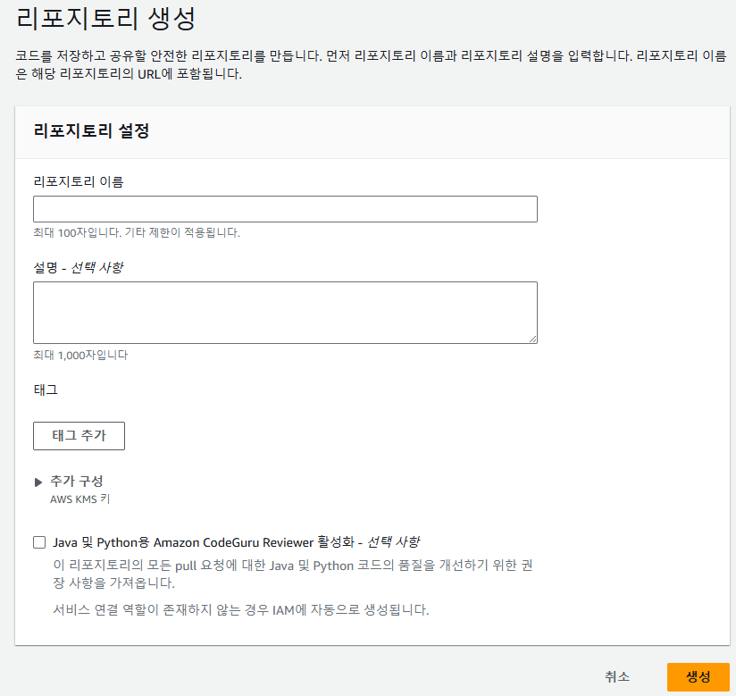

# Delivery and GitOps

## Step 1. Private git repository
* AWS search to codecommit
* top rigth button is repository create click
  <figure align="center">
    
    <figcaption align="center">CodeCommit service repository create screen</figcaption>
  </figure>
* Add repository name and description optional text

> Note : codecommit service is GitHub DVCS system use equal git command line using for Remote repository

## Step 2. gitUser access getting
* ## 1.
  ```bash
  aws iam list-ssh-public-keys --user-name gitUser
  ```

* ## 2.
  ```bash
  KEYID=$(aws iam list-ssh-public-keys --user-name gitUser | jq -r '.[] | .[] | .SSHPublicKeyId')
  echo $KEYID
  ```

* ## 3. 
  ```bash
  cat ~/.ssh/config
  ```

  ```bash
  cat ~/.ssh/id_rsa
  ```

* ## 4.
  ```bash
  ssh git-codecommit.$AWS_REGION.amazonaws.com
  ```

  ```bash
  aws iam list-access-keys --user-name ecrUser
  ```

# Jenkins
* ## 1.
  ```bash
  cd ~/appcode && ls
  ```

  ```bash
  cat jenkins
  ```
  
  ```python
  /* Jenkinsfile */
  def imageTag
  node {

      def app

      stage('Clone repository') {
          /* Let's make sure we have the repository cloned to our workspace */

          checkout scm
      }

      stage('Build image') {
          /* This builds the actual image; synonymous to
          * docker build on the command line */

          app = docker.build("eks-gitops-demo")
      }

      stage('Test image') {
          /* Run a test framework against our image. */

          /*app.inside {
              sh 'echo "Tests passed"'
          }*/
          echo "Tests passed"
      }

      stage('Push image') {
          /* Finally, we'll push the image with two tags:
          * First, the incremental build number from Jenkins
          * Second, the 'latest' tag.
          * Pushing multiple tags is cheap, as all the layers are reused. */
          imageTag = sh(script: "head -n 1 Dockerfile | sed 's/#//'", returnStdout: true).trim()
          docker.withRegistry('https://ACCOUNTID.dkr.ecr.REGION.amazonaws.com', 'ecr:REGION:ecrUser') {
          /*    app.push("${env.BUILD_NUMBER}") */
              app.push("${imageTag}")
              app.push("latest")
          }
          echo "Pushed image with tag: ${imageTag}"
      }
  }
  ```