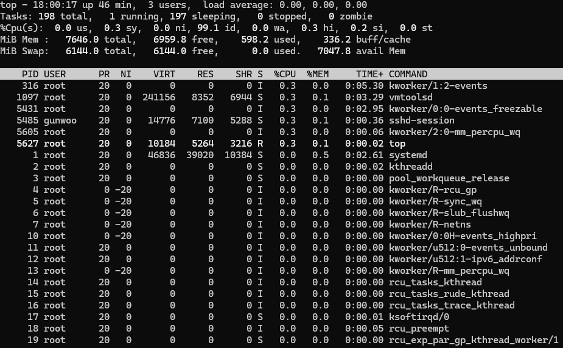
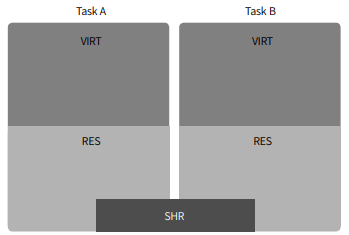

# System information check

## 1. Top
<figure align="center">
  
  <figcaption align="center">Memory Array</figcaption>
</figure>

```bash
# CMD
top
```

* ## 1.2 Useing to system resource
  > **CMD :** `top -b -n 1`
  ```md
  top - 18:03:53 up 50 min,  3 users,  load average: 0.00, 0.00, 0.00
  Tasks: 198 total,   1 running, 197 sleeping,   0 stopped,   0 zombie
  %Cpu(s):  0.0 us,  0.1 sy,  0.0 ni, 99.8 id,  0.0 wa,  0.1 hi,  0.0 si,  0.0 st
  MiB Mem :   7646.0 total,   6958.8 free,    599.1 used,    336.4 buff/cache
  MiB Swap:   6144.0 total,   6144.0 free,      0.0 used.   7046.9 avail Mem

  > top = 현재 서버의 시간과 얼마나 구동되어 있었는지 시간으로 출력된다
  > load average = 몇명의 유저가 접속하고 있는지와 수행하고 있는 프로세스를 보여준다 [High = 많은 프로세스 수행중]
  > Tasks = 현재 시스템에서 구동 중인 프로세스의 개수를 나타낸다
  > Cpu = #
  > Mib Mem = #
  > Mib Swap = #
  ```

  <figure align="center">
    
    <figcaption align="center">Process memory array</figcaption>
  </figure>

  ```md
    PID USER      PR  NI    VIRT    RES    SHR S  %CPU  %MEM     TIME+ COMMAND
   5485 pitlane   20   0   14776   7100   5288 S   9.1   0.1   0:00.40 sshd-session
   5649 root      20   0   10168   4992   2944 R   9.1   0.1   0:00.01 top
      1 root      20   0   46836  39020  10384 S   0.0   0.5   0:02.61 systemd
      2 root      20   0       0      0      0 S   0.0   0.0   0:00.02 kthreadd
      3 root      20   0       0      0      0 S   0.0   0.0   0:00.00 pool_workqueue_release
      4 root       0 -20       0      0      0 I   0.0   0.0   0:00.00 kworker/R-rcu_gp
      5 root       0 -20       0      0      0 I   0.0   0.0   0:00.00 kworker/R-sync_wq
      6 root       0 -20       0      0      0 I   0.0   0.0   0:00.00 kworker/R-slub_flushw
  {...}

  > PID = 프로세스 넘버
  > USER = 사용자
  > PR / NI = PR [프로세스 우선순위], NI [PR을 조절하여 어떤 우선순위로 실행할지 조절 여부]
  > VIRT / RES / SHR = VIRT [가상 메모리의 전체 크기], RES [사용하는 물리 메모리의 크기], SHR [다른 프로세스와 공유하는 메모리의 크기]
  > S = Process status
  > %CPU / %MEM = CPU와 Memory의 사용 비중 퍼센트
  > TIME+ = 프로세스 수행 시간
  > COMMAND = 명령어 이름
  ```
# System memory
* ## VIRT and RES
  ```md
  VIRE는 Task라는 의미를 가지고 할당된 가상 메모리의 전체 크기를 나타낸다 RES는 실제 메모리에 올려서 사용하고 있는
  물리 메모리의 크기를 나타내며 SHR는 다른 프로세스와 공유하고 있는 메모리의 크기를 말한다
  Lib가 SHR 영역에 포함될 수 잇으며 대부분 Linux 프로세스들은 GLIBC라는 라이브러리를 참조하고 있기 때문에 사용하는
  프로세스마다 공간 낭비가 발생한다 Kernel은 이 경우를 대비해서 공유 메모리라는 개념을 도입했고, 다수의 프로세스가 함께
  사용하는 Lib는 공유 메모리 영역에 올려서 함께 사용하도록 구현했다
  ```

* ## fork
  ```md
  fork() 시스템 콜을 사용하면 Kernel은 현재 실행 중인 프로세스와 똑같은 프로세스를 Clone하게 되는데, 주로 fork후 exec 시스템
  콜을 통해 전혀 다른 프로세스로 변한다
  ```