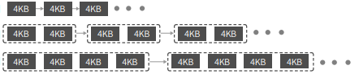

# Swap
```md
물리 메모리가 부족할 경우 대비해서 생성해 놓은 영역이다 부족하면 프로세스가 더 이상 연산을 위한 공간을 확보할 수 없기 때문에 시스템이 응답
불가 상태에 빠질 수 있다 물리 메모리가 아니라 디스크의 일부분을 메모리처럼 사용하기 위해 생성한 공간이기 때문에 메모리가 부족할 때 사용하기
보다는 메모리에 비해 접근과 처리 속도가 현저하게 떨어진다
```

* ## Process ID memory data
  ```bash
  # CMD
  cd /proc/<PID>/smaps
  ```

* ## File system satus
  ```bash
  # CMD
  cat /proc/<PID>/satus

  Name:   sshd-session
  Umask:  0022
  State:  S (sleeping)
  Tgid:   2491
  Ngid:   0
  Pid:    2491
  PPid:   2487
  TracerPid:      0
  Uid:    1000    1000    1000    1000
  Gid:    1000    1000    1000    1000
  {...}
  ```

* ## Smem
  ```bash
  # CMD
  smem -t

   PID User           Command                         Swap      USS      PSS      RSS
  1101 root           /usr/sbin/atd -f                   0      208      279     2524
   959 libstoragemgmt /usr/bin/lsmd -d                   0      240      286     1900
   923 root           /usr/sbin/sedispatch               0      412      589     3400
   958 root           /usr/sbin/irqbalance               0      560      807     4584
   954 dbus           dbus-broker --log 4 --contr        0      788      852     2936
  1103 root           /usr/sbin/crond -n                 0      936     1033     3676
   953 dbus           /usr/bin/dbus-broker-launch        0      884     1187     4796
   919  rpc           /usr/bin/rpcbind -w -f             0      884     1217      574
  {...}
    ----------------------------------------------------------------------------------
   37     7                                              0   152068   189116   399188
  ```

# Buddy system
> Kernel은 Buddy system을 통해서 프로세스에 메모리를 할당한다  
> 물리 메모리를 연속된 메모리 영역으로 관리한다

<figure align="center">
  
  <figcaption align="center">Buddy system memory info</figcaption>
</figure>

```bash
# CMD
cat /proc/buddyinfo

# Result
Node 0, zone      DMA      0      0      0      0      0      0      0      0      0      1      3
Node 0, zone    DMA32      1      2      1      2      3      1      1      1      3      2    679
Node 0, zone   Normal   5749   2649   1304    857    325    151    133     70     36     53    906

> DMA : 4KB + 8KB + 16KB + 32KB + 64KB + 128KB + 256KB + 512KB + 1024KB + 2048KB
> DMA32 : 4KB + 8KB + 16KB + 32KB + 64KB
> Normal : 4KB + 8KB + 16KB
```
