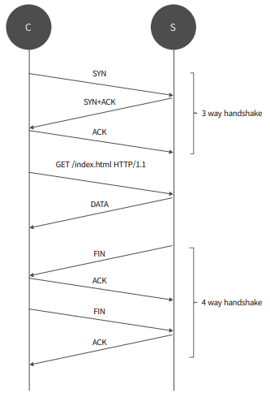

# TCP Socket network
<figure align="center">
  
  <figcaption align="center">Buddy system memory info</figcaption>
</figure>

```md
최초의 연결을 맺게 되는 과정을 3-Way handshake라고 부르며, Client는 서버로 통신을 시작 했다는 SYN을 보내고 서버는
그에 대한 응답으로 SYN + ACK를 보낸다 이후 클라이언트는 서버로 받은 패킷에 대한 응답으로 ACK를 보내
이렇게 3-Way handshake를 정상적으로 마친 다음 클라이언트는 서버에 데이터를 요청한다

> SYN
> ACK
```