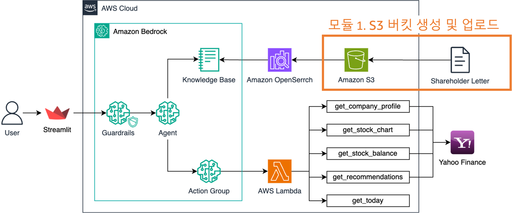
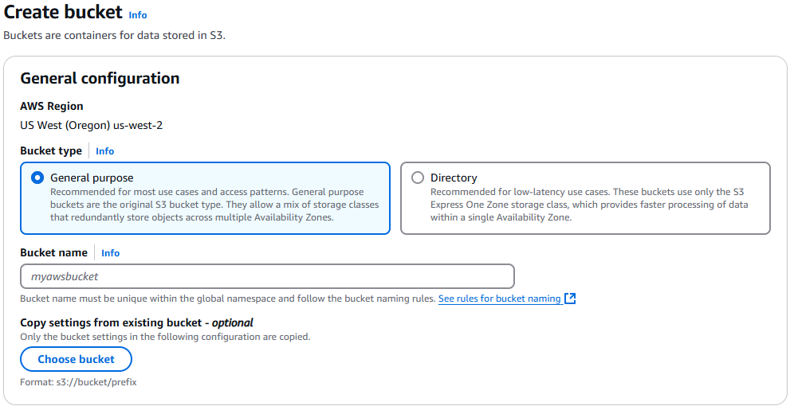
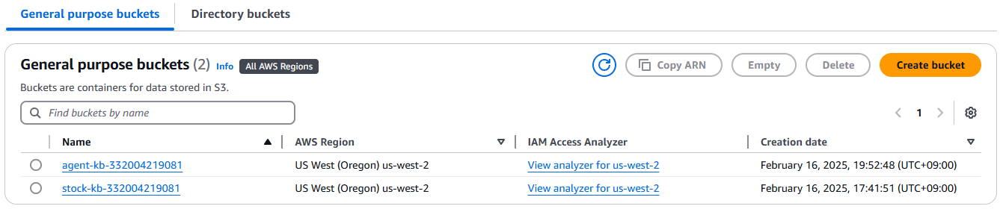
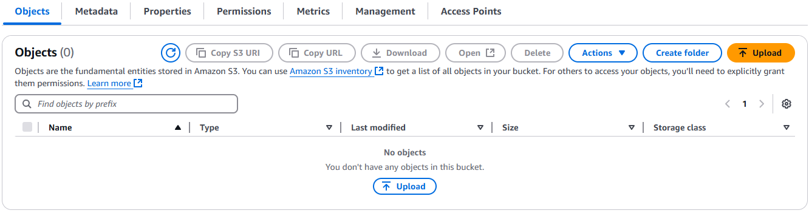
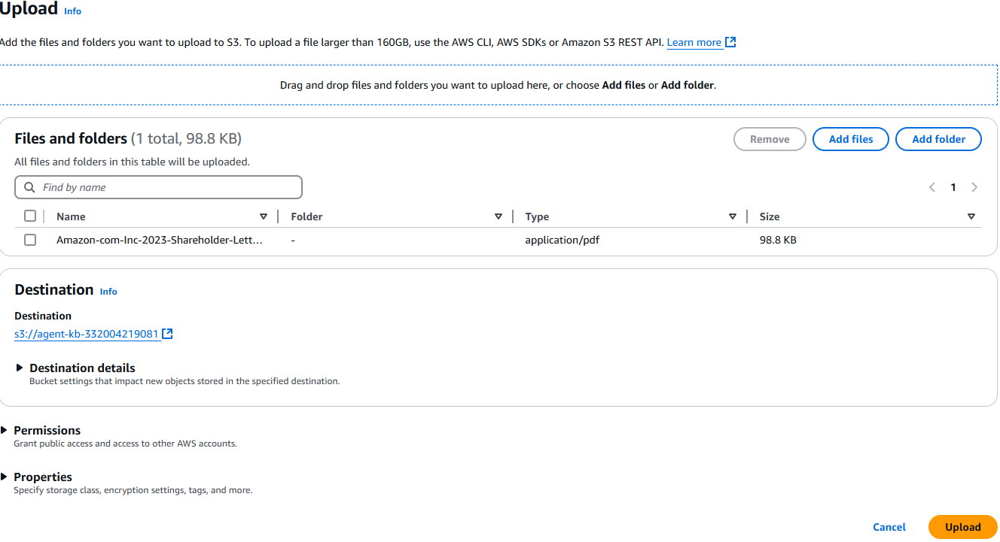
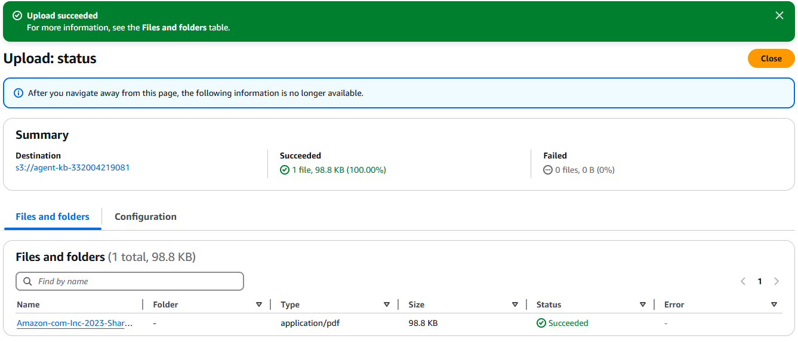

# Bedrock Agent Application
<figure align="center">
  
</figure>

## 1. S3 Bucket
* ### 1.1 S3 Bucket create
  <figure align="center">
    
  </figure>

  > Note : S3 bucket name is bucketname-{accountid}

  <figure align="center">
    
  </figure>

* ### 1.2 S3 Bucket file upload
  <figure align="center">
    
  </figure>

  <figure align="center">
    
  </figure>

  <figure align="center">
    
  </figure>